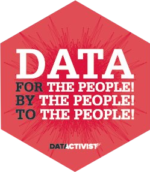
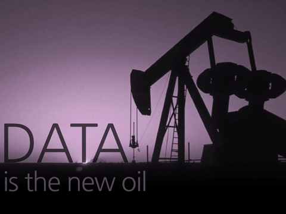
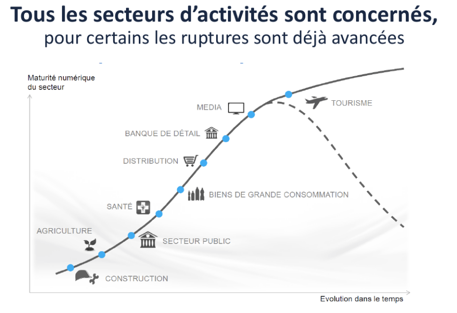
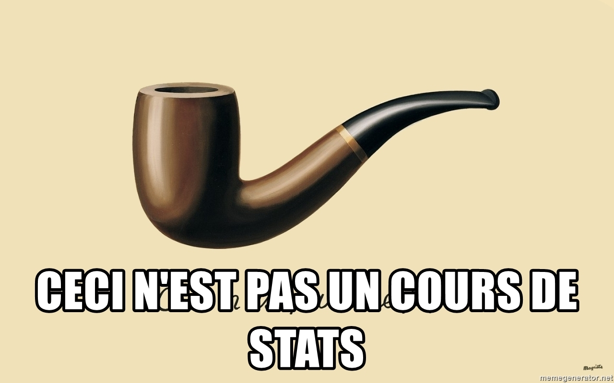

```{r setup, include=FALSE}
options(htmltools.dir.version = FALSE)
knitr::opts_chunk$set(cache = TRUE, widgetframe_widgetsdir = 'widgets')
```

class: inverse, center, middle

# Littératie de données



---
class: center, middle

### Une proposition pédagogique 
### pour Sciences-Po-Saint-Germain


---
## La donnée : "l'or noir du 21e siècle" ?


.center[]

---
## La montée en puissance de la donnée 

- Mouvement de numérisation, de transformation numérique et de connectivité croissante des capteurs, machines et ordinateurs qui démultiplie les sources de données.

- Baisse spectaculaire des coûts de stockage et de traitement des données (loi de Moore) ; nouveaux outils et compétences (*data science*).

- Recherche de la performance de la part des acteurs publics et privés grâce à la donnée, comme aide à la décision.

---
## La donnée participe à bouleverser tous les secteurs  

- La donnée donne lieu à la modification des modèles économiques
  + L’économie de la multitude
  + Modèle de plateforme et d’API
- La transition numérique touche tous types de secteurs, avec une maturité différente 

---
## La donnée participe à bouleverser tous les secteurs

.reduite[]

---
## La culture des données, une nécessité 

- "Culture des données *is the new* Culture générale" ?
- à tous les niveaux hiérarchiques
- dans tous les secteurs
- dans tous les métiers


---
## La culture des données 

- des savoirs
- des compétences (savoir-faire)
- à construire de manière graduelle
- à entretenir tout au long de la vie
- dans tous les secteurs d'activité

---
## L'honnête femme du 21e siècle

Sciences Po forme des "têtes bien faites", des "honnêtes femmes". La culture générale des données en fait nécessairement partie.

---
class: inverse, center, middle

# Notre proposition

---
## Une entrée non-technique



---
## Une progression sur l'ensemble du cursus

```{r, echo=FALSE}
library(DiagrammeR)
mermaid("
gantt
dateFormat  YYYY-MM-DD
title Cursus de Sciences Po Saint-Germain-en-Laye

section Première année
Culture générale des données - Sociohistoire de la quantification - de l'open data au big data  :active,        intro,     2018-09-01, 2018-12-31

section Deuxième année
Les modèles économiques de la donnée      :active,    eco,   2019-09-01, 2019-12-31
Les métiers de la donnée - témoignages :active, metiers, 2020-01-01, 2020-06-30


section Quatrième année
Culture générale des données (pour nouveaux arrivants)  :active,        intro,     2018-09-01, 2018-12-31
Projets collectifs - concours :active, concours, 2018-09-01, 2018-12-31

section Cinquième année
Data et affaires publiques :active, aff_publiques_5, 2018-09-01, 2018-12-31
Data et culture :active, culture_5, 2018-09-01, 2018-12-31
Data et affaires internationales :active, aff_internationales_5, 2018-09-01, 2018-12-31
Data et entreprise :active, entreprise_5, 2018-09-01, 2018-12-31
Data et affaires publiques :active, aff_publiques, 2021-09-01, 2021-12-31
Data et culture :active, culture, 2021-09-01, 2021-12-31
Data et affaires internationales :active, aff_internationales, 2021-09-01, 2021-12-31
Data et entreprise :active, entreprise, 2021-09-01, 2021-12-31

",
width = 800)


```

---
## Volume et format des modules

- Culture générale des données : 20 heures, cours magistral en présentiel + vidéos + supports (slides, lectures...). Validation : quizz en cours ou fin de chaque séance

- Modèles économiques de la donnée : 10h, 5 *case studies* de 2 heures chacun. Documents supports + vidéos et/ou interventions en présentiel. Validation : Réalisation et publication d'un petit  
*case study*.

- Les métiers de la donnée : 10h, 5 témoignages en classe virtuelle ou en présentiel. Validation : quizz.

- Projets collectifs / challenge (4e année) : En intensif pendant une semaine, par équipe. Datactivist trouve les institutions partenaires et mentore. En partenariat avec Simplon, par ex ? Validation : participation effective au challenge.

- Cours thématiques : 2h de cadrage (vidéo, classe virtuelle et supports) et 4 case studies de 2 heures (supports et classe virtuelle). Validation : quizz en cours et fin de séance.

---
class: center, middle, inverse

## À votre disposition pour en discuter !

### Joël Gombin, [joel@datactivist.coop](mailto:joel@datactivist.coop)

